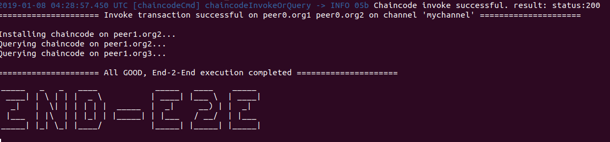

# Kafka Cluster Sample

## [Fabric Download & Build](https://github.com/hyperledger/fabric) 

```text
git clone https://github.com/hyperledger/fabric
cd fabric
make
```


Fabric 환경 구성은 Hyperledger Fabric 환경구성 페이지 참고


## [e2e\_cli network up ](https://github.com/hyperledger/fabric) 

```text
cd example/e2e_cli
./network_setup.sh up mychannel 50000 couchdb
```



## [Invoke & Query Test \(CLI\)](https://github.com/hyperledger/fabric)

```bash
docker exec -it cli bash #CLI 컨테이너 접속

#환경변수 셋팅
export CORE_PEER_LOCALMSPID="Org1MSP"
export PEER0_ORG1_CA=/opt/gopath/src/github.com/hyperledger/fabric/peer/crypto/peerOrganizations/org1.example.com/peers/peer1.org1.example.com/tls/ca.crt
export CORE_PEER_TLS_ROOTCERT_FILE=$PEER0_ORG1_CA
export CORE_PEER_MSPCONFIGPATH=/opt/gopath/src/github.com/hyperledger/fabric/peer/crypto/peerOrganizations/org1.example.com/users/Admin@org1.example.com/msp
export CORE_PEER_ADDRESS=peer0.org1.example.com:7051
export ORDERER_CA=/opt/gopath/src/github.com/hyperledger/fabric/peer/crypto/ordererOrganizations/example.com/orderers/orderer.example.com/msp/tlscacerts/tlsca.example.com-cert.pem
export CHANNEL_NAME=mychannel

#Query Test
peer chaincode query -C $CHANNEL_NAME -n mycc -c '{"Args":["query","a"]}'

#Invoke Test
peer chaincode invoke -o orderer.example.com:7050  --tls \
--cafile '/opt/gopath/src/github.com/hyperledger/fabric/peer/crypto/ordererOrganizations/example.com/orderers/orderer.example.com/msp/tlscacerts/tlsca.example.com-cert.pem' \
-C 'mychannel' -n mycc  \
--peerAddresses peer0.org1.example.com:7051 --tlsRootCertFiles /opt/gopath/src/github.com/hyperledger/fabric/peer/crypto/peerOrganizations/org1.example.com/peers/peer0.org1.example.com/tls/ca.crt \
--peerAddresses peer0.org2.example.com:7051 --tlsRootCertFiles /opt/gopath/src/github.com/hyperledger/fabric/peer/crypto/peerOrganizations/org2.example.com/peers/peer0.org2.example.com/tls/ca.crt \
-c '{"Args":["invoke","a","b","10"]}'

#orderer 컨테이너에서 블럭 생성 및 delivery 로그 확인
docker logs -f orderer.example.com

#chaincode 로그 확인
docker logs -f dev-peer0.org1.example.com-mycc-1.0 

#couchdb Fauxton 접속확인
http://localhost:5984/_utils/
```

## [e2e\_cli network down](https://github.com/hyperledger/fabric)

```text
./network_setup.sh down
```


